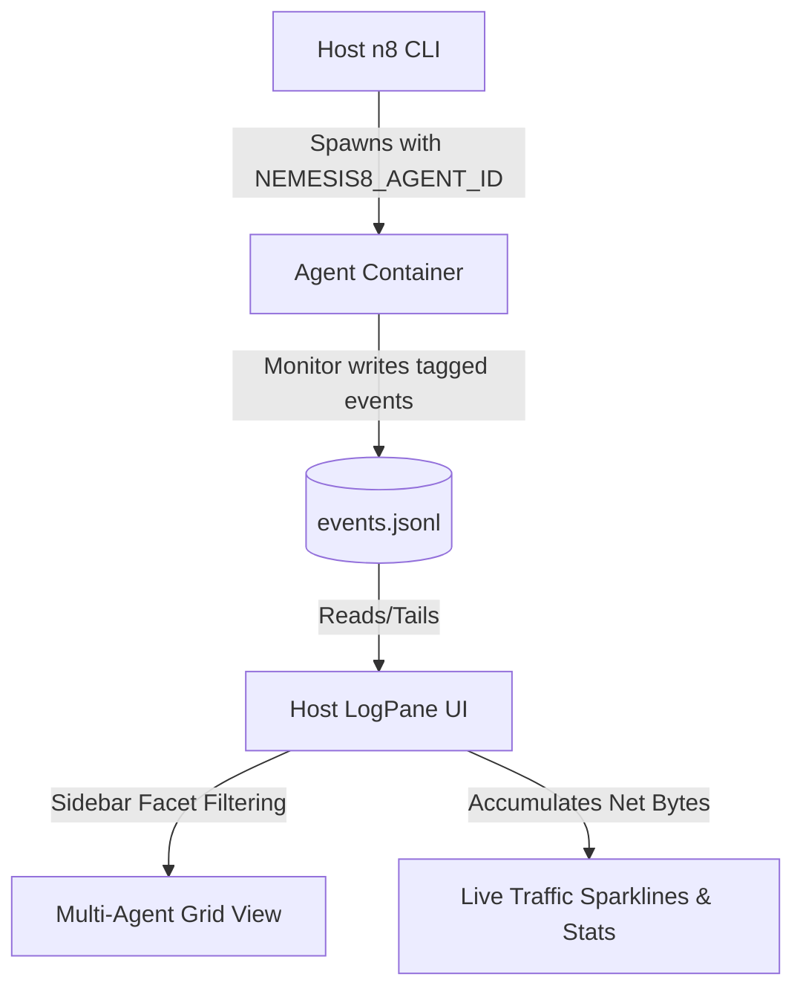

# Multi-Agent Monitoring Aggregation, Identity & Network TUI Plan

This plan details the design for aggregating agent/container telemetry in `nemesis8`, ensuring container identity mapping, and adding container-specific network throughput stats along with TUI graphs in the log monitor panel (LOGPANE).

---

## 1. Architecture Overview

Every running container runs a background `nemesis8-monitor` daemon. Each daemon collects CPU, memory, load, and network stats, appending them as serialized JSON lines to a shared filesystem egress:
`~/.nemesis8/home/.monitor/events.jsonl`

To enable multi-agent visibility, each event must carry the producing container's identity, allowing the host-side `n8` CLI to parse, filter, and render container-specific network throughput metrics and graph visualizations.



---

## 2. Updated Plan & Features

### Phase A: Container Identity Tagging (`agent_id`)
1. **Env Injection**: Modify `docker::build_env` to read the container name (e.g., `n8-glint-otter`) and inject it into the container environment as `NEMESIS8_AGENT_ID`.
2. **Monitor Tagging**: Update the monitor daemon (`src/monitor.rs` and `src/collectors.rs`) to:
   * Read `NEMESIS8_AGENT_ID` on startup.
   * Append `"agent_id": "n8-glint-otter"` to every generated metric, log line, or pulse event.

### Phase B: Log Rotation
To prevent `events.jsonl` from growing indefinitely:
* When `events.jsonl` reaches `32 MB`, rename it to `events.jsonl.1` (log rotation) and start a new file.
* Keep the index tail-reader reading the latest file (and falling back to `.1` if needed for history).

### Phase C: Container Network Throughput Tracking
1. **Network Egress Data**: The metrics collector in `src/collectors.rs` will compute real-time download (`net_rx_bps`) and upload (`net_tx_bps`) rates by reading container `/proc/net/dev` interfaces.
2. **Identity-Tagged Metrics**: These rates are written every 5 seconds to `events.jsonl` tagged with the correct `agent_id`.

### Phase D: Slick TUI Network Graphs & Traffic Display
In `src/logpane.rs`, we will introduce a **Live Network Monitor Section** at the top of the LOGPANE (toggled by the `e` screen):

1. **Bytes In/Out Display**:
   * For each active container, aggregate and display the most recent data transfer rates:
     ```
     n8-swift-hare   | In: 1.4 MB/s | Out: 120 KB/s
     n8-glint-otter  | In:  45 KB/s | Out:   2 KB/s
     ```
2. **Simple Text-Based Sparkline / Bar Graph**:
   * Maintain a small ring buffer (e.g., last 10 ticks) of network activity for each container.
   * Render a simple block-based horizontal sparkline graph (using Unicode characters ` `, `▂`, `▃`, `▄`, `▅`, `▆`, `▇`, `█`) representing the recent traffic trend:
     ```
     n8-swift-hare   [▃▅█▆▃▂▂   ]  In: 1.4 MB/s  Out: 120 KB/s
     n8-glint-otter  [  ▂▃▃▂    ]  In:  45 KB/s  Out:   2 KB/s
     ```

---

## 3. Implementation Steps & Locations

### 1. Host CLI Setup
* **[src/docker.rs](file:///C:/Users/kordl/Code/DeepBlueDynamics/nemesis8/src/docker.rs)**: Inject `NEMESIS8_AGENT_ID` env variable when spawning containers.
* **[src/event_index.rs](file:///C:/Users/kordl/Code/DeepBlueDynamics/nemesis8/src/event_index.rs)**: Add `agent_id` field to `IndexedEvent`, parsing it from incoming logs.

### 2. Container telemetry
* **[src/monitor.rs](file:///C:/Users/kordl/Code/DeepBlueDynamics/nemesis8/src/monitor.rs)**: Serialize `agent_id` into metric JSONs.
* **[src/collectors.rs](file:///C:/Users/kordl/Code/DeepBlueDynamics/nemesis8/src/collectors.rs)**: Add log rotation checks in the file-appending logic.

### 3. TUI Panel Rendering
* **[src/logpane.rs](file:///C:/Users/kordl/Code/DeepBlueDynamics/nemesis8/src/logpane.rs)**:
  * Create a new `NetworkWidget` panel.
  * Render a list of active agents with their current throughput rates.
  * Draw the Unicode sparkline chart for network history per agent.
